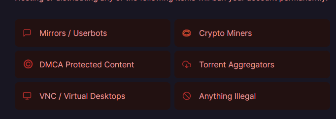

| Method            | /products   |/products/{id} | 
|-------------------|-------------|---------------|
| GET               |   Get list  |    Get        |
| PUT               | Replace     |Update/Replace | 
| PATCH             | No Apply    |     Update    | 
| POST              | Create      | No Apply      |
| DELETE            | Delete      | Delete        |

# Get
>Obterner
# Put
>Modificar/Actualizar =>  Cualquier número de solicitudes repetidas e idénticas dejará el recurso en el mismo estado. Requiere todos los atributos.
# Patch
>Modificar/Actualizar => actualiza valores especificos, actualizaciones parciales
# Post
>Crear
# Delete
>Eliminar

# SRP Single Responsability principle
Se debe organizar para que cada parte o archivo del codigo sea especifica en lo que controla. 

# Middlewares 
* Funcionan como pipes
* Validar datos
* Capturar errores
* Validar permisos
* Controlar accesos

``` js
function (req, res, next){
  if(something){
    res.send('end')
  }else{
    next();
  }
}
``` 

# Middlewares importantes

## CORS
Middleware para habilitar CORS (Cross-origin resource sharing) en nuestras rutas o aplicación. http://expressjs.com/en/resources/middleware/cors.html

Se tiene un dominio, si las peticiones salen del mismo origen el backend acepta la petición. El tema es cuando hay varios origenes, aplicaciones que corren en diferentes dominios. Por defecto el backend los cancela

## Morgan
Un logger de solicitudes HTTP para Node.js. http://expressjs.com/en/resources/middleware/morgan.html

## Helmet
Helmet nos ayuda a proteger nuestras aplicaciones Express configurando varios encabezados HTTP. ¡No es a prueba de balas de plata, pero puede ayudar! https://github.com/helmetjs/helmet

## Express Debug
Nos permite hacer debugging de nuestras aplicaciones en Express mediante el uso de un toolbar en la pagina cuando las estamos desarrollando. https://github.com/devoidfury/express-debug

## Express Slash
Este middleware nos permite evitar preocuparnos por escribir las rutas con o sin slash al final de ellas. https://github.com/ericf/express-slash

## Passport
Passport es un middleware que nos permite establecer diferentes estrategias de autenticación a nuestras aplicaciones. https://github.com/jaredhanson/passport

Puedes encontrar más middlewares populares en el siguiente enlace: http://expressjs.com/en/resources/middleware.html

# Railway
Como alternativa a heroku por que ahora es de pago elegí Railway https://railway.app/dashboard
Tiene prohibido desplegar este tipo de aplicaciones



# DOCKER
Se usa para administrar bases de datos,se debe en un archivo con nombre

**Importante: TENER EJECUTANDO EL DOCKER**

>docker-compose.yml
Escribir este codigo:

``` yml
version: '3.3'

services:
  postgres:
    image: postgres:13
    environment:
      - POSTGRES_DB=store-api
      - POSTGRES_USER=daniel
      - POSTGRES_PASSWORD=admin12345
    ports:
     - '5432:5432'
    volumes:
      - ./postgres_data:/var/lib/postgresql/data

``` 
Usamos este comando para que funcione en segundo plano y con el nombre de la base de datos en este caso postgres
>docker-compose up -d postgres

Con este comando vemos donde esta corriendo 
>docker-compose ps
